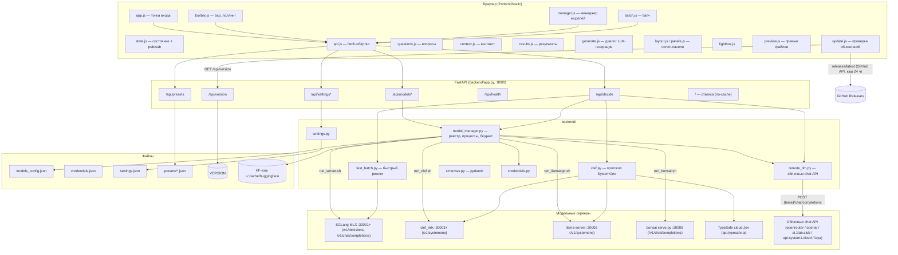
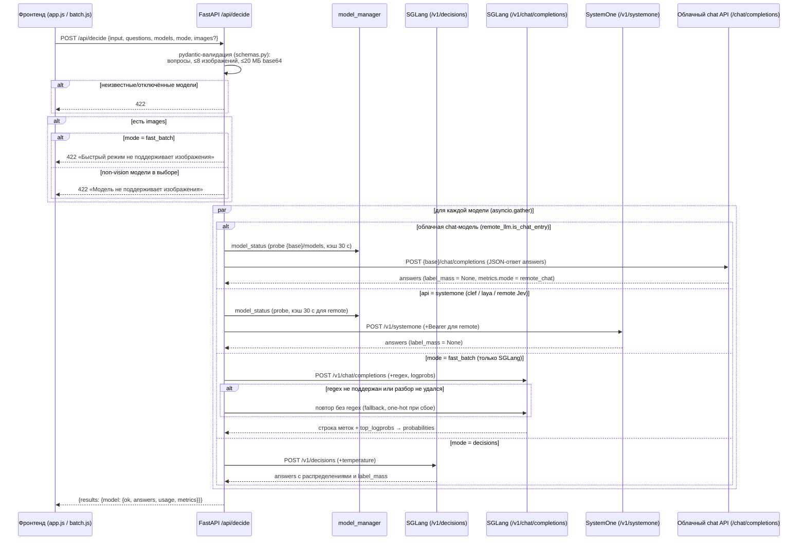
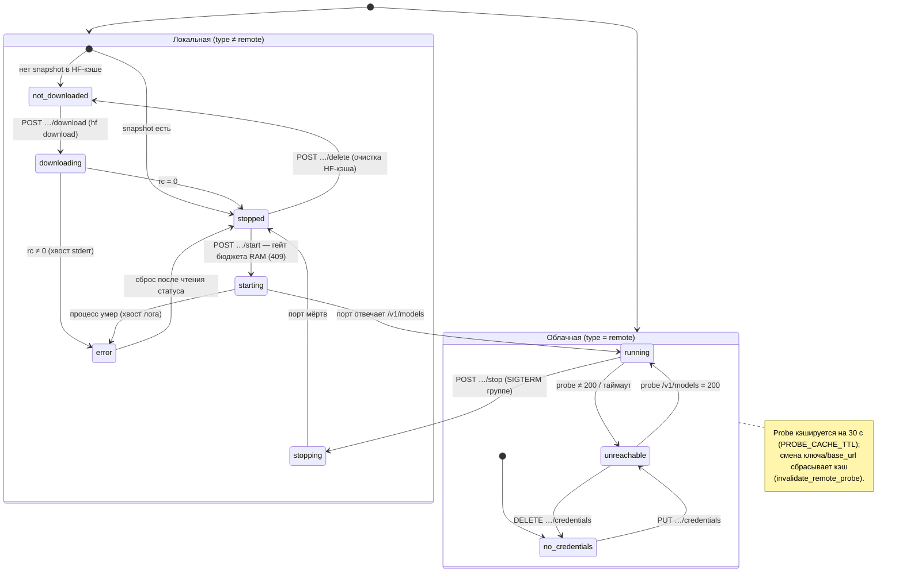
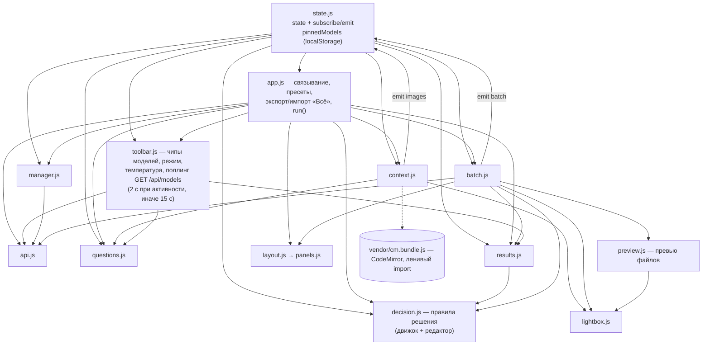
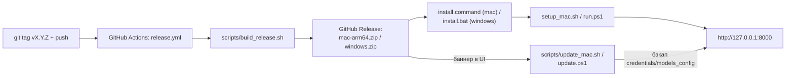

# ARCHITECTURE.md — Decision-QA

> Правило: любое изменение архитектуры (новые модули, эндпоинты, статусы,
> потоки данных) обновляет этот файл в том же изменении.

## Обзор

Decision-QA — однопользовательское локальное веб-приложение: браузерный
фронтенд (ванильные ES-модули без сборки, `frontend/static/`) ↔ backend на
FastAPI (`backend/`, порт 8000) ↔ модельные серверы.

Модельные серверы пяти видов (`ModelEntry.type`):

- **SGLang MLX** (`type=sglang`) — локальные LLM через SGLang с MLX-бэкендом
  (Apple Silicon); decide-протокол `/v1/decisions` + `/v1/chat/completions`
  для быстрого батча.
- **Clef** (`type=clef`) — decision-модели Cloudflare в MLX-конвертации,
  `clef_mlx.py serve`, протокол `/v1/systemone` (один не-авторегрессионный
  проход на все вопросы, vision).
- **llama.cpp** (`type=llamacpp`) — GGUF-модель Laya через `llama-server`,
  тот же протокол `/v1/systemone`.
- **Bonsai** (`type=bonsai`, эксперимент) — `prism-ml/Ternary-Bonsai-2-27B-mlx-2bit`,
  2-бит ternary MLX-пак с кастомным `model_type: prism_hadamard_qwen35`;
  грузится только собственным runtime из репо модели (каталог `runtime/`
  в снапшоте, ревизия зафиксирована в `server/run_bonsai.sh`). Сервер —
  `server/bonsai/serve.py` (OpenAI-совместимый `/v1/chat/completions` со
  стримингом SSE, `/v1/models`, `/health`; vision-паки через
  `runtime/vision_artifact.py` поверх mlx-vlm, text-only — через
  `runtime/artifact.py` + ручной цикл генерации). Только роль `chat`
  (ассистент с инструментами в hermes-формате), в decide-прогонах не участвует.
- **Remote** (`type=remote`) — облачные модели двух подвидов: серверы наших
  протоколов (TypeSafe cloud **Jev**, `https://api.typesafe.ai`) по протоколу
  `decisions` или `systemone`, и облачные chat API (`remote_llm.APIS`:
  openrouter, openai, clef cloud `ai.1lab.club`, systemone cloud
  `api.system1.cloud`, laya) по OpenAI-совместимому `/chat/completions`;
  процессом не управляем, нужен API-ключ (env `<API>_API_KEY` или
  `credentials.json`). `api="systemone"` — chat только с base_url
  `api.system1.cloud` (или без base_url), иначе это протокол `/v1/systemone`.

Backend поднимает/останавливает локальные серверы раннерами
`server/run_server.sh` (SGLang), `server/run_clef.sh` (clef_mlx),
`server/run_llamacpp.sh` (llama-server), `server/run_bonsai.sh`
(bonsai serve.py); логи — `server/logs/<key>.log`.
Веса моделей — в HF-кэше `~/.cache/huggingface/hub` (скачивание через
`hf download` с парсингом tqdm-прогресса из stderr).

Файлы состояния backend:

- `backend/models_config.json` — реестр моделей (читается только при старте;
  правки из UI персистятся атомарной записью через `save_registry()`).
- `backend/credentials.json` — API-ключи remote-моделей (chmod 600; наружу
  через API не возвращаются, только флаг `has_credentials`).
- `backend/settings.json` — `budget_fraction` (доля RAM под бюджет моделей;
  приоритет: файл > env `MODELS_BUDGET_FRACTION` > 0.65).
- `backend/.setup_state.json` — sha256 конфига после последнего применения
  профиля RAM скриптом `scripts/setup_mac.sh` (защита ручных правок).
- `backend/presets/*.json` — встроенные пресеты (source=`builtin`).
- `backend/presets_user/*.json` — пользовательские пресеты (source=`user`;
  в git не коммитятся, исключаются из релизного архива, бэкапятся
  апдейтерами). Оба каталога мерджатся `GET /api/presets` — при совпадении
  slug пользовательский перекрывает встроенный.

Статика фронтенда монтируется тем же FastAPI-приложением (`/`), с
`Cache-Control: no-cache` (etag остаётся, браузер ревалидирует).

**Решение** — логические правила поверх ответов на вопросы (блок «Решение»
в редакторе, под «Вопросами», на обеих страницах; карточки «Вопросы» и
«Решение» лежат в общей скролл-зоне `.vsplit-bottom-zone` под вертикальным
сплиттером). Вычисляет детерминированный
движок на фронте (`decision.js`), НЕ модель: исходы (название, цвет — свотчи
вместо select, не более одного `isDefault`) проверяются по порядку, побеждает
первый, чьё правило сработало; иначе — исход по умолчанию, без него —
«не определено». Правило —
условия (`anyOf=false` — все, И; `true` — хотя бы одно, ИЛИ): для yes_no/choice —
вероятность конкретного ответа против порога (`answer` + `op: gte/lt` +
`threshold` 0..1), для score — средний балл (0-based, `answers[qid].score`)
против порога (`score` вместо `answer`). Результат движка несёт `trace` —
детализацию каждого проверенного условия (факт vs порог); из него
`describeDecision` строит hover-объяснение «почему сработал исход» на чипах
и бейджах (✓/✗-строки). Флаг `enabled` (дефолт `true`, тумблер «Учитывать
в прогоне» в шапке блока): при `enabled=false` решение хранится и
редактируется, но не валидируется, не вычисляется и не попадает в
результаты/экспорт (нет чипов, колонки «Решение», CSV/JSON-полей);
в пресетах сохраняется (сервер пропускает неизвестные поля). Решение
считается отдельно для каждой модели (в батче — файл×модель): чипы над
результатами одиночного прогона
(+ «⚡ решения различаются»), колонка «Решение» в батч-таблице, колонка
`решение` в CSV, поля `decision`/`decisions` в JSON-экспорте. Правила хранятся
в пресетах (`payload.decision`, серверная валидация `preset_store._check_decision`),
LLM-генерация — `POST /api/decision/generate`, предложения ассистента —
инструмент `propose_decision` (ссылки на вопросы по `n` из снапшота, пороги
в процентах; маппинг в id и 0..1 — на фронте при применении).

## Диаграммы

### 1. Компонентная

### 2. Прогон `/api/decide`

### 3. Жизненный цикл модели

### 4. Фронтенд: модули и поток состояния

## Модули

### Backend (`backend/`)

| Файл | Ответственность | Ключевое |
|---|---|---|
| `app.py` | Маршруты API, оркестрация `/api/decide` (asyncio.gather по моделям), статика с no-cache | `decide`, `_decide_one`, `NoCacheStaticFiles` |
| `schemas.py` | Pydantic-модели запроса и валидация (типы вопросов, лимиты изображений, mime data URL только png/jpeg/webp/gif — HEIC и пр. отклоняются с 422 и понятным текстом) | `DecideRequest`, `Question`, `build_sglang_payload` |
| `model_manager.py` | Реестр моделей (поле `roles`: `decision` — прогоны, `chat` — ассистент; дефолт миграции по типу: sglang → обе, bonsai → `chat`, остальные → `decision`), запуск/остановка процессов раннерами, скачивание в HF-кэш, бюджет RAM, статусы, TTL-кэш пробы remote | `REGISTRY`, `model_status`, `start_model`, `stop_model`, `start_download`, `save_registry` |
| `fast_batch.py` | Быстрый режим: все вопросы одним `/v1/chat/completions` с regex-ограничением, вероятности из top_logprobs, fallback без regex | `run`, `build_messages`, `build_regex`, `parse_content_answers`, `softmax_probabilities` |
| `clef.py` | Протокол SystemOne (Clef/Laya/remote): сборка запроса `/v1/systemone`, маппинг ответа в формат answers | `run`, `build_systemone_request`, `question_payload`, `map_answers` |
| `remote_llm.py` | Облачные chat API (`APIS`: openrouter/openai/clef cloud/systemone cloud/laya): `remote_chat` (OpenAI-совместимый `/chat/completions`, ключ из env `<API>_API_KEY` → `credentials.json`), decide одним chat-вызовом с JSON-ответом (`run_decide`, metrics.mode=`remote_chat`, label_mass=None), LLM-генерация вопросов (`generate_questions`) и правил решения (`generate_decision`; нормализация `parse_generated_decision` — id исходов o1.., проценты → 0..1, валидация `preset_store._check_decision`; локальный путь для sglang/bonsai — в `app.py`: проба `/v1/models` → chat completions с `enable_thinking`, парсинг общими `parse_generated_*`) | `remote_chat`, `is_chat_entry`, `chat_base_url`, `run_decide`, `generate_questions`, `build_generate_messages`, `parse_generated_questions`, `generate_decision`, `build_decision_generate_messages`, `parse_generated_decision` |
| `credentials.py` | API-ключи remote-моделей в `credentials.json` (chmod 600, атомарная запись) | `get`, `has`, `save`, `delete` |
| `settings.py` | `budget_fraction`: файл > env > дефолт, атомарный персист | `load_budget_fraction`, `save_budget_fraction` |
| `preset_store.py` | Пресеты: мердж `presets/` + `presets_user/`, CRUD пользовательских (slug из имени, защита от traversal, лимиты изображений), валидация правил решения (`_check_decision`: уникальные метки исходов, ≤1 default, ссылки на существующие id вопросов, `answer` из вариантов, `threshold` 0..1, `score` в пределах шкалы), builtin только для чтения | `list_presets`, `create_preset`, `rename_preset`, `delete_preset`, `slugify` |
| `presets/_gen_image_presets.py` | Ручной генератор image-пресетов (stdlib-рисование PNG) | `main` |
| `presets/_gen_returns_preset.py` | Генератор пресета «Возвраты: претензии с фото»: фото из /tmp/returns_photos → `batch_returns_claims.json` (5 текстов × 0–3 фото data URL); кредиты — `PHOTO_CREDITS.md` | `main` |
| `assistant/` | AI-ассистент: агентный цикл по chat-моделям (роль `chat` в models_config.json), инструменты с валидацией аргументов, SSE-стрим событий (token/thinking/tool/proposal/trial/done/error); при 400 «context length» — один ретрай с урезанной историей и max_tokens 1024; sglang-серверы стартуют с context_length 32768 (поле `context_length` в models_config.json). Инструменты включены для всех chat-моделей: локальные (sglang/bonsai) — hermes-формат `<tool_call><function=…>` с подсказкой `HERMES_FORMAT_HINT` в system-промпте, блуждающая разметка вырезается `_StreamFilter`'ом (пары маркеров: `<tool_call>…</tool_call>`, голый `<function=…</function>`, спецтокены `<|tool_call|>` и `<｜tool▁call｜>`, явные `<think>…</think>`; `finish()` добирает хвост буфера при обрыве — текст отдаётся, обрывки разметки выбрасываются); облачные (`remote_llm.is_chat_entry`) — `run_remote_agent`: нативный OpenAI tool calling поверх SSE-стрима (tool_calls из дельт по index, assistant/tool-сообщения с `tool_call_id`, `delta.reasoning`/`reasoning_content` → thinking-события) с фолбэком на hermes-парсинг content, если провайдер tools не разобрал. Управление рассуждением: флаг `thinking` из UI пробрасывается обоим агентам; openrouter → `reasoning {"enabled": bool}`, прочие OpenAI-совместимые → `reasoning_effort high/low` с фолбэком (400/422 → ретрай без параметра); при thinking max_tokens 4096, иначе 2048 (reasoning-токены делят бюджет). Устойчивость цикла: кап рассуждений по времени (`THINKING_TIME_CAP` 90 с — при превышении upstream-стрим прерывается, клиенту уходит tool-заметка, шаг повторяется с выключенным рассуждением — у локальных `enable_thinking=false`, у облачных `reasoning {"enabled": false}`; нативных лимитов thinking у sglang/bonsai нет), таймауты по шагам (`STEP_TIMEOUT` 300 с на шаг, `TOTAL_TIMEOUT` 900 с на цикл; любой таймаут — честный SSE `error`), обрыв по `finish_reason=length` с пустым content после рассуждения — понятный SSE error вместо молчаливого done, отмена клиентом пробрасывается на upstream (закрытие httpx-стрима останавливает генерацию на sglang; у bonsai фоновый поток догенерирует — HTTP закрыт). Системный промпт (`prompts.py`): правила — язык ответа = язык пользователя, лаконичность (~вдвое короче), resultsSummary анализируется до run_trial (прогон — только за новыми данными), вопросы — переиспользуемые классификаторы (не подгонка под текущий экземпляр контекста), ссылки на вопросы — по номеру из снапшота (поле `n`, id модели недоступны); `serialize_snapshot` режет снапшот по приоритету (resultsSummary/questions сохраняются всегда, первым ужимается context.text; потолок ~6000) | `router.py` (`/api/assistant/*`), `agent.py` (`run_agent`, `run_remote_agent`), `tools.py`, `prompts.py` |
| `assistant/trial.py` | Пробный прогон (инструмент `run_trial`, авто-исполняется на сервере, не proposal): ≤5 вопросов × ≤3 запущенных decision-моделей на тексте контекста одиночного режима через `/api/decide`; изображения/батч не участвуют (для страницы «Батч» — ошибка модели). Вопросам из снапшота без id дозаполняются `q1..qN`; текстовая сводка ссылается на текст вопроса (≤50 симв.), не на id. Результат: сводка модели + SSE-событие `trial` {questions, models, rows, note?} | `run_trial` |

Кроссплатформенность backend: `total_ram_gb()` — psutil в первую очередь
(macOS/Linux/Windows), `sysctl hw.memsize` — фолбэк на macOS без psutil, далее
консервативные 32 ГБ. Запуск/остановка локальных моделей — POSIX-only
(раннеры `server/run_*.sh`, `os.killpg`); на не-POSIX ОС `start_model`/
`stop_model` отклоняют локальные модели с человекочитаемой ошибкой,
remote-модели работают полностью (см. `docs/windows.md`).

### Установка и запуск (`scripts/`)

- `scripts/setup_mac.sh` — идемпотентная установка на macOS: проверки
  uv/python3.12/git, venv'ы backend (`.venv-test`) и clef
  (`server/clef/.venv`); SGLang/llama.cpp не ставит (печатает инструкции,
  при отсутствии SGLang выключает sglang-модели). По RAM выбирает профиль
  `enabled` в `models_config.json`: ≥48 ГБ — без изменений, 24–48 — выключает
  модели с `peak_gb` > 15, <24 — remote-only (все локальные off, `jev-latest`
  on). Ручные правки конфига защищены sidecar-хэшем `backend/.setup_state.json`;
  переприменение — флагом `--force`.
- `scripts/run.sh` — запуск uvicorn на :8000 (фон, `server/logs/app.log`) +
  открытие браузера; идемпотентно (не поднимает второй инстанс).
  Переменная `DQ_NO_OPEN=1` подавляет открытие браузера (используется
  автозапуском).
- `scripts/run.ps1` — запуск на Windows (remote-only): сам создаёт venv и
  ставит зависимости при первом запуске.

### Релизы, установка и обновления (`scripts/`)

- `VERSION` в корне — текущая версия; отдаётся эндпоинтом `GET /api/version`.
- `frontend/static/update.js` при старте сравнивает `/api/version` с latest-тегом
  GitHub Releases (кэш в localStorage 24 ч; сбой сети — тихий фейл) и показывает
  баннер с командой обновления.
- `scripts/update_mac.sh` / `scripts/update.ps1` — скачивают последний релиз,
  бэкапят `credentials.json` / `models_config.json` / `settings.json`,
  распаковывают поверх, доводят зависимости и перезапускают backend.
- `scripts/autostart_mac.sh on|off|status` — LaunchAgent (`RunAtLoad`,
  `DQ_NO_OPEN=1`); `scripts/autostart_windows.ps1 -Action on|off|status` —
  задача Планировщика при входе. По умолчанию выключено (opt-in).
- `scripts/uninstall_mac.sh` / `scripts/uninstall_windows.ps1` — остановка
  backend, снятие автозапуска, удаление каталога (с подтверждением;
  HF-кэш моделей не трогают без явного согласия). В дистрибутивах лежат в
  корне архива рядом с install-файлами.
- `scripts/build_release.sh` — сборка обоих zip из рабочего дерева
  (без тестов/кэша/секретов); workflow вызывает его на push тега `v*`.

### Frontend (`frontend/static/`)

| Файл | Ответственность | Ключевые экспорты |
|---|---|---|
| `app.js` | Точка входа: пресеты, запуск прогонов (single), экспорт/импорт «Всё», связывание модулей | — (side effects) |
| `state.js` | Глобальное состояние + pub/sub, пины моделей в localStorage | `state`, `subscribe`, `emit`, `selectedModelKeys`, `initPinnedModels`, `togglePinnedModel` |
| `api.js` | fetch-обёртки над API | `getModels`, `decide`, `startModel`, `stopModel`, `downloadModel`, `deleteModelFiles`, `patchModel`, `createRemoteModel`, `removeModel`, `putCredentials`, `deleteCredentials`, `getPresets`, `createPreset`, `renamePreset`, `deletePreset`, `setBudgetFraction`, `generatePreset`, `generateQuestions`, `generateDecision` |
| `toolbar.js` | Бар: чипы/выбор моделей (только роль `decision`), режим прогона, температура, пресеты (меню «Файл → Пресеты» сгруппировано «Одиночные»/«Батч», max-height 70vh со скроллом, бейдж 🖼 у image-пресетов), меню экспорта/импорта, «Свернуть/развернуть все» (карточки вопросов и исходов решения), поллинг статусов (2 с / 15 с) | `initToolbar`, `refreshModels`, `refreshRunButton`, `setPageMode` |
| `questions.js` | Конструктор вопросов: карточки (с номером `№n` в шапке — ему соответствует `n` в снапшоте ассистента), drag&drop, схлопывание, валидация, экспорт | `addQuestion`, `setQuestions`, `buildQuestionsPayload`, `exportQuestions`, `normalizeQuestion`, `mountQuestions`, `renderQuestions`, `setAllCollapsed`, `removeQuestion`, `moveQuestion`, `typeIcon` |
| `decision.js` | «Решение»: движок логических правил поверх ответов (чистый, считает фронт; результат несёт `trace` условий для hover-объяснений — `explainDecision`/`describeDecision`) + редактор блока на обеих страницах (тумблер «Учитывать в прогоне» — `decision.enabled`, дефолт true; исходы: сворачиваемые карточки с drag&drop, цвет — свотчи, «иначе»; правила с И/ИЛИ; условия: P(ответа) ≥/< порога % или средний балл score) + подсказки полноты (`decisionHints`) и валидация перед прогоном/сохранением | `evaluateDecision`, `explainDecision`, `describeDecision`, `normalizeDecision`, `setDecision`, `validateDecision`, `decisionHints`, `mountDecision`, `addOutcome`, `setAllOutcomesCollapsed`, `renderDecision`, `OUTCOME_COLORS`, `COLOR_NAMES`, `COLOR_LABELS`, `answerLabel` |
| `context.js` | Контекст: текст/JSON (CodeMirror по требованию), изображения (до 8), импорт/экспорт JSON | `initContext`, `buildInput`, `buildImagesPayload`, `setContent`, `setImages`, `hasContent`, `exportContext`, `contextSnapshot`, `downloadJson`, `importJsonFile`, `parseImport`, `applyImportedContext`, `validateJsonMode`, `describeJsonError`, `toggleContextFullscreen`, `addImageFiles` |
| `results.js` | Рендер результатов: таблица сравнения, дрилдаун, тултипы распределений, чипы решений над списком (`renderDecisionChips`: «модель: исход», «⚡ решения различаются»; hover на чипе — объяснение из trace через `attachDecisionTip`; скрыты при `decision.enabled === false`) | `renderResults`, `flattenRuns`, `resultQuestions`, `pairsDisagree`, `renderAnswerDrilldown`, `distributionBars`, `shortAnswer`, `answerConfidence`, `confClass`, `modelLabel`, `modelShortLabel`, `showTip`, `hideTip`, `attachDecisionTip` |
| `batch.js` | Страница «Батч»: файлы (текст/картинки), к текстовому файлу прикрепляются до 3 изображений (📎, миниатюры с ✕; в payload — `images`, модели сужаются до vision), прогон, таблица файлы × вопросы (image-файлы: миниатюра → лайтбокс, клик по имени → дрилдаун; текстовые: hover/клик по имени → превью через preview.js, дрилдаун по стрелке; прикреплённые картинки — миниатюры в колонке «Файл» и в дрилдауне), колонка «Решение» (бейдж исхода по `explainDecision` с hover-объяснением из trace, агрегат «Исход×N» в «Итого», строка в дрилдауне; колонка/бейджи/CSV отключаются при `decision.enabled === false`, решение не валидируется и не снапшотится), агрегаты, CSV (колонка `решение`)/JSON (`decision` + `decisions`); `batch_files` в экспорте/пресетах: текст → `{name, content, images?}`, картинка → `{name, image}` | `initBatch`, `runBatch`, `resetBatch`, `isBatchEmpty`, `loadPresetFiles`, `batchFilesSnapshot`, `attachImagesToFile`, `removeFileImage`, `renderBatchResults`, `buildBatchCsv` |
| `manager.js` | Страница «Модели»: статусы, запуск/стоп/скачивание, бюджет RAM, бейджи и чекбоксы ролей (прогоны/ассистент), длина контекста sglang, remote-модели и их ключи; форма добавления — выбор API (облачные chat из `remote.js` или свой сервер decisions), для chat API base_url необязателен, api_model обязателен | `initManager` |
| `remote.js` | Реестр облачных chat API (зеркало `remote_llm.APIS`) и предикаты для селекторов генерации/ассистента | `CHAT_APIS`, `isChatApi`, `isChatRemote`, `remoteChatModels` |
| `generate.js` | Общий диалог LLM-генерации для пресетов (✨ на странице пресетов) и вопросов (✨ рядом с «+ Вопрос», обе страницы): модели из `GET /api/assistant/models` (enabled chat, облачные с ☁), описание задачи, чекбокс «Рассуждение» (выкл по умолчанию → thinking в запросе) | `openGenerateDialog`, `closeGenerateDialog` |
| `presets.js` | Менеджер пресетов: страница со списком (применить/переименовать/удалить — только user; клонировать — любой в редактируемую user-копию), диалог «Сохранить как пресет» (снапшот контекста/батча + вопросы с direction + правила решения + картинки), «✨ Сгенерировать…» — LLM-генерация пресета chat-моделью через generate.js → `POST /api/presets/generate` → createPreset, экспорт пресета в самодостаточный .json (без slug/source), импорт | `initPresets`, `openPresetsPage`, `openSaveDialog`, `closeDialog` |
| `imageutil.js` | Белый список форматов изображений (PNG/JPEG/WebP/GIF): проверка файла, accept-строка, сообщение об отклонённых (HEIC и пр.) | `isSupportedImageFile`, `rejectedImagesMessage`, `IMAGE_ACCEPT` |
| `layout.js` | Двухпанельная компоновка страницы «Одиночный» + вертикальный сплит «Контекст | зона Вопросы+Решение» | `initLayout` |
| `panels.js` | Фабрика сплит-панелей (ширина, фокус ⛶, сворачивание, Esc) и вертикального сплита (`createVSplit`: нижняя часть — элемент после сплиттера; в index.html это `.vsplit-bottom-zone` — общая скролл-зона карточек «Вопросы»+«Решение», обе страницы) | `createSplitLayout`, `createVSplit` → `{ init }` |
| `lightbox.js` | Лайтбокс изображений (singleton-оверлей, Fullscreen API) | `openLightbox`, `closeLightbox`, `isLightboxOpen` |
| `preview.js` | Превью файлов: image → делегирует лайтбоксу; text → singleton-оверлей с `<pre>`, fullscreen (API + CSS-фолбэк), Esc/клик по фону | `openPreview`, `closePreview`, `isPreviewOpen` |
| `update.js` | Проверка обновлений: /api/version vs GitHub Releases (кэш 24 ч, dismiss по версии) | `parseVersion`, `isNewerVersion`, `checkForUpdate`, `renderUpdateBanner`, `initUpdate` |
| `assistant.js` | AI-ассистент: выдвижная панель справа (overlay, кнопка «✨ Ассистент» в тулбаре), ресайз drag-ручкой слева (320–720px, localStorage `dq-assistant-width`; ≤760px — во весь экран). Чат — собственный, на обычном DOM (без shadow DOM и внешних чат-движков): лента `#assistant-messages`, markdown ответов через вендоренный remarkable (`vendor/remarkable.js`, `html:false` — XSS-safe) в `.assistant-md` (13px). SSE `/api/assistant/chat` (fetch + ручной парсер `parseSseChunk`): token → инкрементальный innerHTML пузыря, thinking → сворачиваемый `
` в ленте, tool → служебная строка `.assistant-note` (элемент хранится напрямую, мутация `textContent` по done/error), trial/proposal → DOM-карточки в ленте, error → красная строка, обрыв/отмена → служебные строки. Компоновка панели: шапка (заголовок + ×), лента с welcome `.assistant-intro` (скрывается при первом сообщении, возвращается после «Сброс»), `.assistant-input-area` (авто-растущий textarea до 160px, Enter — отправить, Shift+Enter — перевод строки) и футерная строка контролов (селектор модели, «Рассуждение», «Сброс»). Реплики ассистента — без фона на всю ширину, user — синие плашки справа. Кнопка `#assistant-send` — круг: submit — белый paper-plane на синем; пока запрос активен (токены, thinking, инструменты) получает `.is-stop` (белый квадрат на красном) и видна ВСЕГДА → AbortController на fetch (строка «остановлено пользователем», частичный текст остаётся; «соединение прервано» — только нештатный обрыв без done). Индикатор «печатает» — три CSS-анимированные точки в теле ленты. Кнопка «✨ Ассистент» в тулбаре при закрытой панели: `is-working` (три мигающие точки, `.tb-assistant-dots`) на всё время активного запроса, `has-unread` (акцентная точка в углу) по завершении (done/error), снимается при открытии панели; ручная остановка бейдж не ставит (updateToolbarButton — в updateSendButton и open/close панели). Селектор chat-моделей (облачные помечены ☁), снапшот состояния с каждым сообщением (контекст ≤4000, вопросы с порядковым `n`, без технических id, модели, файлы батча, сводка результатов ≤3000 с отметкой ⚡ расхождений ответов между моделями), событие `trial` → карточка «Пробный прогон» в ленте (UI не мутирует), proposals АВТО-ПРИМЕНЯЮТСЯ по получении с карточкой-записью в ленте и кнопкой «Отменить» (undo по снимку состояния для вопросов/контекста; run/preset без undo): undo — прямое замыкание на кнопке карточки, статус («Применено ✓»/«Отменено») — мутация DOM карточки — применение чисто клиентское через questions/context/toolbar/presets/decision (`propose_decision` — правила решения: ссылки на вопросы по `n` из снапшота, пороги в процентах 0–100, маппинг в id и 0..1 при применении; в снапшоте — текущие правила, в сводке результатов — строка «решение: модель=«исход»») | `initAssistant`, `buildSnapshot`, `sendMessage`, `handleProposal`, `applyProposal`, `captureUndo`, `handleTrial`, `parseSseChunk`, `resetHistory`, `initResize`, `updateSendButton` |
| `vendor/remarkable.js` | Вендоренный remarkable 2.0.1 (MIT) — markdown-рендер ответов ассистента (GFM-таблицы, списки, код), браузерный ESM без сборки; лицензия — `vendor/LICENSE.remarkable` | — |
| `vendor/cm.bundle.js` | Собранный CodeMirror (JSON-режим контекста), ленивый dynamic import | — |

## Эндпоинты API

Все ответы об ошибках валидации — 422 с человекочитаемым `detail`
(единый handler `RequestValidationError` в `app.py`).

| Метод и путь | Назначение | Ответ / особенности |
|---|---|---|
| `GET /api/models` | Список моделей со статусами + RAM/бюджет устройства | `{models, device}`; probe remote кэшируется 30 с |
| `POST /api/models` | Добавление remote-модели | 422 при ошибке полей |
| `PATCH /api/models/{key}` | Правка `label`/`short_label`/`enabled`/`base_url`/`roles`/`context_length` | персист в `models_config.json` |
| `DELETE /api/models/{key}` | Удаление remote-модели из реестра | локальным — 422 (выключаются через PATCH) |
| `PUT /api/models/{key}/credentials` | Сохранить API-ключ remote-модели | сбрасывает кэш пробы; ключ наружу не возвращается |
| `DELETE /api/models/{key}/credentials` | Удалить API-ключ | сбрасывает кэш пробы |
| `POST /api/models/{key}/download` | Скачивание в HF-кэш (`hf download`, фон) | 409 уже скачана/качается |
| `POST /api/models/{key}/delete` | Удаление файлов модели из HF-кэша | 409 запущена/качается |
| `POST /api/models/{key}/start` | Запуск сервера модели (идемпотентно) | 409 при нехватке бюджета RAM |
| `POST /api/models/{key}/stop` | Остановка (SIGTERM группе, включая процессы, пережившие перезапуск бэкенда) | 409 порт занят чужим процессом |
| `GET /api/settings` | `{budget_fraction, budget_gb, total_ram_gb}` | — |
| `PUT /api/settings/budget` | Смена доли бюджета (0.3–0.95) на лету + персист | 422 вне диапазона |
| `GET /api/presets` | Мердж `presets/` (builtin) + `presets_user/` (user, перекрывает при совпадении slug); у каждого `slug` и `source` | массив пресетов |
| `POST /api/presets` | Создать/перезаписать пользовательский пресет (валидация payload, лимиты изображений) | 422 при невалидном теле |
| `PATCH /api/presets/{slug}` | Переименовать пользовательский пресет | 404 нет такого; 422 builtin |
| `DELETE /api/presets/{slug}` | Удалить пользовательский пресет | 404 нет такого; 422 builtin |
| `POST /api/presets/generate` | LLM-генерация пресета: `{model_key, description, thinking?}` → `{name?, description?, questions}` любой chat-моделью (роль `chat`, enabled): облачная — `remote_chat` (при `thinking` → `reasoning_effort: "high"`, на 400/422 — один ретрай без него), локальная (sglang/bonsai) — `POST {url}/v1/chat/completions` с `chat_template_kwargs.enable_thinking` | 422 не chat-модель; 409 локальная не запущена; 502 ошибка LLM |
| `POST /api/questions/generate` | LLM-генерация вопросов: `{model_key, input?, hint?, thinking?}` → `{questions}` (тот же конвейер, что у presets/generate) | 422 не chat-модель; 409 локальная не запущена; 502 ошибка LLM |
| `POST /api/decision/generate` | LLM-генерация правил решения: `{model_key, questions, input?, hint?, thinking?}` → `{decision}` (тот же конвейер; ответ нормализуется и валидируется `_check_decision`) | 422 не chat-модель/пустые questions; 409 локальная не запущена; 502 ошибка LLM или невалидный JSON правил |
| `POST /api/decide` | Прогон вопросов по моделям (см. sequence-диаграмму) | `{results}`; 422: неизвестные/отключённые модели, изображения в fast_batch, non-vision с изображениями |
| `GET /api/health` | Статусы всех моделей одним запросом | `{models: {key: status}}` |
| `GET /api/version` | Версия приложения из `VERSION` | `{version}`; fallback `"dev"` |
| `GET /api/assistant/models` | Модели, пригодные для ассистента (роль `chat`, enabled) | `{models: [{key, label, remote}]}`; `remote: true` — облачная chat-модель |
| `POST /api/assistant/chat` | Чат ассистента: `{model_key, message, history, snapshot, thinking}` → SSE-стрим событий `token`/`thinking`/`tool`/`proposal`/`trial`/`done`/`error` | `text/event-stream`; 409 «Модель не запущена»; 422 валидация |
| `POST /api/assistant/propose/validate` | Серверная валидация аргументов proposal-инструмента | `{ok, error?}` |
| `GET /…` | Статика фронтенда (`frontend/static`) | `Cache-Control: no-cache` |

Нисходящие вызовы к модельным серверам: `POST /v1/decisions` (SGLang),
`POST /v1/chat/completions` (fast_batch, SGLang/llama.cpp; ассистент — также
bonsai :30006),
`POST /v1/systemone` (Clef/llama.cpp/remote Jev),
`POST {base_url}/chat/completions` (облачные chat API из `remote_llm.APIS`,
Bearer-ключ из env `<API>_API_KEY` или `credentials.json`), `GET /v1/models`
(health-проба портов и remote, с Bearer-ключом для remote; у chat-моделей
проба идёт на `{base_url}/models`).

## Упрощения и техдолг

### Удалено при чистке мёртвого кода (этап актуализации документа)

- `layout.js` — обёртки-реэкспорты `applyLayout`/`setFocus`/`resetPanels`/
  `collapsePanel` (ни одного вызова; наружу нужен только `initLayout`).
- `panels.js` — возвращаемый объект фабрики сокращён до `{ init }`.
- `context.js` — `getContextText()` (заменён внутренним `currentText()`).
- `questions.js` — `importQuestions()` (вытеснен `parseImport`/`importJsonFile`).
- `api.js` — `getSettings()` (менеджер читает бюджет из `GET /api/models`).
- Снят `export` с символов, используемых только внутри своих модулей:
  `state.savePinnedModels`, `context.setMode`/`removeContextImage`/
  `renderContextImages`, `questions.TYPE_LABELS`/`DIRECTIONS`,
  `results.MODE_LABELS`, `batch.addFiles`, `toolbar.hasImagesAttached`.

### Осознанно оставлено

- `decision.js` — снят `export` с `emptyDecision`/`answerOptions`
  (только внутреннее использование). Кандидаты на разрезку (>800 строк):
  `batch.js`, `assistant.js`, `results.js` — разрезка отложена до отдельной
  ревизии, поведенческого долга в них не найдено.
- `model_manager._auth_headers()` вызывается из `app.py`, `clef.py`,
  `fast_batch.py` — кросс-модульное использование «приватного» по имени
  хелпера. Не баг, но при касании стоит переименовать без подчёркивания.
- `style.css` без глубокой чистки классов: часть инвариантов покрыта
  contract-тестами фронтенда, остальное безопасно проверять только
  визуально в браузере.
- `presets/_gen_image_presets.py` — одноразовый по сути генератор, но это
  воспроизводимый источник пресетов с изображениями; хранится рядом с ними.
- Результаты не перерендериваются по событию поллинга `models` (см. комментарий
  в `app.js`): перерендер уничтожал строки под курсором.
- `fast_batch`-fallback без regex — приближение: при слиянии токенов
  распределение покрывающего токена применяется к каждой позиции, при полном
  сбое выравнивания — one-hot.
