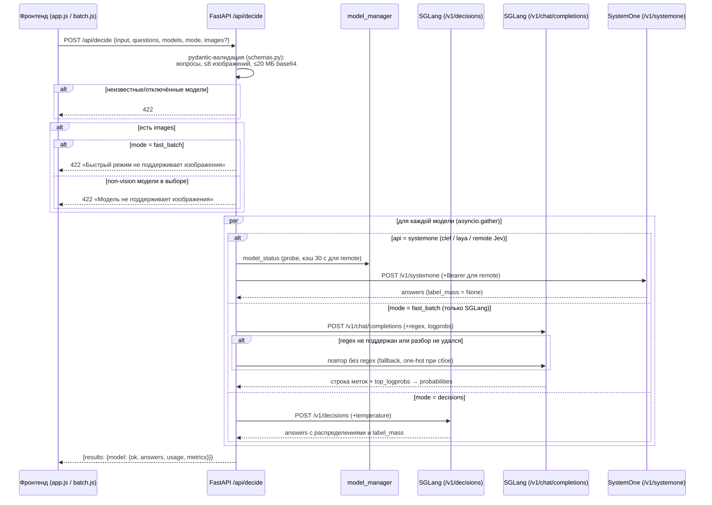
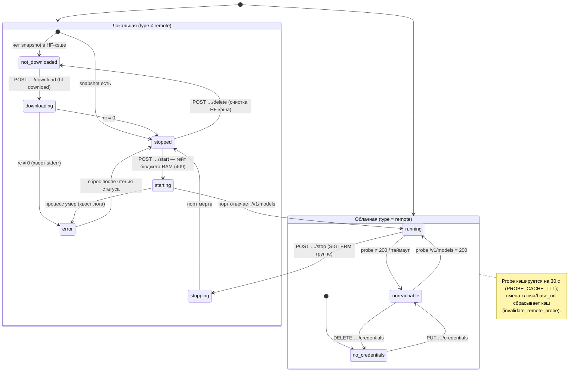
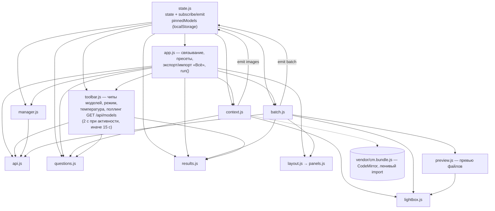
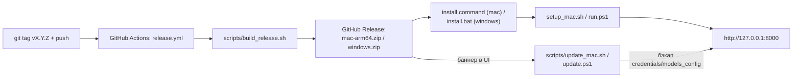

# ARCHITECTURE.md — Decision-QA

> Правило: любое изменение архитектуры (новые модули, эндпоинты, статусы,
> потоки данных) обновляет этот файл в том же изменении.

## Обзор

Decision-QA — однопользовательское локальное веб-приложение: браузерный
фронтенд (ванильные ES-модули без сборки, `frontend/static/`) ↔ backend на
FastAPI (`backend/`, порт 8000) ↔ модельные серверы.

Модельные серверы четырёх видов (`ModelEntry.type`):

- **SGLang MLX** (`type=sglang`) — локальные LLM через SGLang с MLX-бэкендом
  (Apple Silicon); decide-протокол `/v1/decisions` + `/v1/chat/completions`
  для быстрого батча.
- **Clef** (`type=clef`) — decision-модели Cloudflare в MLX-конвертации,
  `clef_mlx.py serve`, протокол `/v1/systemone` (один не-авторегрессионный
  проход на все вопросы, vision).
- **llama.cpp** (`type=llamacpp`) — GGUF-модель Laya через `llama-server`,
  тот же протокол `/v1/systemone`.
- **Remote** (`type=remote`) — облачные модели (TypeSafe cloud **Jev**,
  `https://api.typesafe.ai`) по протоколу `decisions` или `systemone`;
  процессом не управляем, нужен API-ключ.

Backend поднимает/останавливает локальные серверы раннерами
`server/run_server.sh` (SGLang), `server/run_clef.sh` (clef_mlx),
`server/run_llamacpp.sh` (llama-server); логи — `server/logs/<key>.log`.
Веса моделей — в HF-кэше `~/.cache/huggingface/hub` (скачивание через
`hf download` с парсингом tqdm-прогресса из stderr).

Файлы состояния backend:

- `backend/models_config.json` — реестр моделей (читается только при старте;
  правки из UI персистятся атомарной записью через `save_registry()`).
- `backend/credentials.json` — API-ключи remote-моделей (chmod 600; наружу
  через API не возвращаются, только флаг `has_credentials`).
- `backend/settings.json` — `budget_fraction` (доля RAM под бюджет моделей;
  приоритет: файл > env `MODELS_BUDGET_FRACTION` > 0.65).
- `backend/.setup_state.json` — sha256 конфига после последнего применения
  профиля RAM скриптом `scripts/setup_mac.sh` (защита ручных правок).
- `backend/presets/*.json` — пресеты, отдаются через `GET /api/presets`.

Статика фронтенда монтируется тем же FastAPI-приложением (`/`), с
`Cache-Control: no-cache` (etag остаётся, браузер ревалидирует).

## Диаграммы

### 1. Компонентная

```mermaid
graph TD
    subgraph Browser["Браузер (frontend/static)"]
        APP[app.js — точка входа]
        STATE[state.js — состояние + pub/sub]
        API[api.js — fetch-обёртки]
        TB[toolbar.js — бар, поллинг]
        QM[questions.js — вопросы]
        CTX[context.js — контекст]
        RES[results.js — результаты]
        BATCH[batch.js — батч]
        MGR[manager.js — менеджер моделей]
        LAY["layout.js / panels.js — сплит-панели"]
        LB[lightbox.js]
        PV[preview.js — превью файлов]
        UPD[update.js — проверка обновлений]
    end

    subgraph FastAPI["FastAPI (backend/app.py, :8000)"]
        EP_MODELS["/api/models*"]
        EP_SETTINGS["/api/settings*"]
        EP_PRESETS["/api/presets"]
        EP_DECIDE["/api/decide"]
        EP_HEALTH["/api/health"]
        EP_VERSION["/api/version"]
        STATIC["/ — статика (no-cache)"]
    end

    subgraph BackendCore["backend/"]
        MM[model_manager.py — реестр, процессы, бюджет]
        FB[fast_batch.py — быстрый режим]
        CLEF[clef.py — протокол SystemOne]
        SCH[schemas.py — pydantic]
        CRED[credentials.py]
        SET[settings.py]
    end

    subgraph Servers["Модельные серверы"]
        SG["SGLang MLX :30001+ (/v1/decisions, /v1/chat/completions)"]
        CF["clef_mlx :30003+ (/v1/systemone)"]
        LC["llama-server :30005 (/v1/systemone)"]
        RM["TypeSafe cloud Jev (api.typesafe.ai)"]
    end

    subgraph Files["Файлы"]
        MC[models_config.json]
        CR[credentials.json]
        ST[settings.json]
        PR["presets/*.json"]
        VF[("VERSION")]
        HF[("HF-кэш ~/.cache/huggingface")]
    end

    APP --> API
    TB --> API
    MGR --> API
    BATCH --> API
    UPD -->|GET /api/version| EP_VERSION
    UPD -->|releases/latest (GitHub API, кэш 24 ч)| GHR[("GitHub Releases")]
    API --> EP_MODELS
    API --> EP_SETTINGS
    API --> EP_PRESETS
    API --> EP_DECIDE
    EP_MODELS --> MM
    EP_SETTINGS --> SET
    EP_DECIDE --> MM
    EP_DECIDE --> FB
    EP_DECIDE --> CLEF
    EP_PRESETS --> PR
    EP_VERSION --> VF
    MM --> MC
    MM --> HF
    MM --> CRED
    SET --> ST
    MM -->|run_server.sh| SG
    MM -->|run_clef.sh| CF
    MM -->|run_llamacpp.sh| LC
    FB --> SG
    CLEF --> CF
    CLEF --> LC
    CLEF --> RM
```

### 2. Прогон `/api/decide`



### 3. Жизненный цикл модели



### 4. Фронтенд: модули и поток состояния



## Модули

### Backend (`backend/`)

| Файл | Ответственность | Ключевое |
|---|---|---|
| `app.py` | Маршруты API, оркестрация `/api/decide` (asyncio.gather по моделям), статика с no-cache | `decide`, `_decide_one`, `NoCacheStaticFiles` |
| `schemas.py` | Pydantic-модели запроса и валидация (типы вопросов, лимиты изображений) | `DecideRequest`, `Question`, `build_sglang_payload` |
| `model_manager.py` | Реестр моделей, запуск/остановка процессов раннерами, скачивание в HF-кэш, бюджет RAM, статусы, TTL-кэш пробы remote | `REGISTRY`, `model_status`, `start_model`, `stop_model`, `start_download`, `save_registry` |
| `fast_batch.py` | Быстрый режим: все вопросы одним `/v1/chat/completions` с regex-ограничением, вероятности из top_logprobs, fallback без regex | `run`, `build_messages`, `build_regex`, `parse_content_answers`, `softmax_probabilities` |
| `clef.py` | Протокол SystemOne (Clef/Laya/remote): сборка запроса `/v1/systemone`, маппинг ответа в формат answers | `run`, `build_systemone_request`, `question_payload`, `map_answers` |
| `credentials.py` | API-ключи remote-моделей в `credentials.json` (chmod 600, атомарная запись) | `get`, `has`, `save`, `delete` |
| `settings.py` | `budget_fraction`: файл > env > дефолт, атомарный персист | `load_budget_fraction`, `save_budget_fraction` |
| `presets/_gen_image_presets.py` | Ручной генератор image-пресетов (stdlib-рисование PNG) | `main` |

Кроссплатформенность backend: `total_ram_gb()` — psutil в первую очередь
(macOS/Linux/Windows), `sysctl hw.memsize` — фолбэк на macOS без psutil, далее
консервативные 32 ГБ. Запуск/остановка локальных моделей — POSIX-only
(раннеры `server/run_*.sh`, `os.killpg`); на не-POSIX ОС `start_model`/
`stop_model` отклоняют локальные модели с человекочитаемой ошибкой,
remote-модели работают полностью (см. `docs/windows.md`).

### Установка и запуск (`scripts/`)

- `scripts/setup_mac.sh` — идемпотентная установка на macOS: проверки
  uv/python3.12/git, venv'ы backend (`.venv-test`) и clef
  (`server/clef/.venv`); SGLang/llama.cpp не ставит (печатает инструкции,
  при отсутствии SGLang выключает sglang-модели). По RAM выбирает профиль
  `enabled` в `models_config.json`: ≥48 ГБ — без изменений, 24–48 — выключает
  модели с `peak_gb` > 15, <24 — remote-only (все локальные off, `jev-latest`
  on). Ручные правки конфига защищены sidecar-хэшем `backend/.setup_state.json`;
  переприменение — флагом `--force`.
- `scripts/run.sh` — запуск uvicorn на :8000 (фон, `server/logs/app.log`) +
  открытие браузера; идемпотентно (не поднимает второй инстанс).
  Переменная `DQ_NO_OPEN=1` подавляет открытие браузера (используется
  автозапуском).
- `scripts/run.ps1` — запуск на Windows (remote-only): сам создаёт venv и
  ставит зависимости при первом запуске.

### Релизы, установка и обновления (`scripts/`)



- `VERSION` в корне — текущая версия; отдаётся эндпоинтом `GET /api/version`.
- `frontend/static/update.js` при старте сравнивает `/api/version` с latest-тегом
  GitHub Releases (кэш в localStorage 24 ч; сбой сети — тихий фейл) и показывает
  баннер с командой обновления.
- `scripts/update_mac.sh` / `scripts/update.ps1` — скачивают последний релиз,
  бэкапят `credentials.json` / `models_config.json` / `settings.json`,
  распаковывают поверх, доводят зависимости и перезапускают backend.
- `scripts/autostart_mac.sh on|off|status` — LaunchAgent (`RunAtLoad`,
  `DQ_NO_OPEN=1`); `scripts/autostart_windows.ps1 -Action on|off|status` —
  задача Планировщика при входе. По умолчанию выключено (opt-in).
- `scripts/uninstall_mac.sh` / `scripts/uninstall_windows.ps1` — остановка
  backend, снятие автозапуска, удаление каталога (с подтверждением;
  HF-кэш моделей не трогают без явного согласия). В дистрибутивах лежат в
  корне архива рядом с install-файлами.
- `scripts/build_release.sh` — сборка обоих zip из рабочего дерева
  (без тестов/кэша/секретов); workflow вызывает его на push тега `v*`.

### Frontend (`frontend/static/`)

| Файл | Ответственность | Ключевые экспорты |
|---|---|---|
| `app.js` | Точка входа: пресеты, запуск прогонов (single), экспорт/импорт «Всё», связывание модулей | — (side effects) |
| `state.js` | Глобальное состояние + pub/sub, пины моделей в localStorage | `state`, `subscribe`, `emit`, `selectedModelKeys`, `initPinnedModels`, `togglePinnedModel` |
| `api.js` | fetch-обёртки над API | `getModels`, `decide`, `startModel`, `stopModel`, `downloadModel`, `deleteModelFiles`, `patchModel`, `createRemoteModel`, `removeModel`, `putCredentials`, `deleteCredentials`, `getPresets`, `setBudgetFraction` |
| `toolbar.js` | Бар: чипы/выбор моделей, режим прогона, температура, пресеты, меню экспорта/импорта, поллинг статусов (2 с / 15 с) | `initToolbar`, `refreshModels`, `refreshRunButton`, `setPageMode` |
| `questions.js` | Конструктор вопросов: карточки, drag&drop, схлопывание, валидация, экспорт | `addQuestion`, `setQuestions`, `buildQuestionsPayload`, `exportQuestions`, `normalizeQuestion`, `mountQuestions`, `renderQuestions`, `setAllCollapsed`, `removeQuestion`, `moveQuestion`, `typeIcon` |
| `context.js` | Контекст: текст/JSON (CodeMirror по требованию), изображения (до 8), импорт/экспорт JSON | `initContext`, `buildInput`, `buildImagesPayload`, `setContent`, `setImages`, `hasContent`, `exportContext`, `contextSnapshot`, `downloadJson`, `importJsonFile`, `parseImport`, `applyImportedContext`, `validateJsonMode`, `describeJsonError`, `toggleContextFullscreen`, `addImageFiles` |
| `results.js` | Рендер результатов: таблица сравнения, дрилдаун, тултипы распределений | `renderResults`, `flattenRuns`, `resultQuestions`, `pairsDisagree`, `renderAnswerDrilldown`, `distributionBars`, `shortAnswer`, `answerConfidence`, `confClass`, `modelLabel`, `modelShortLabel`, `showTip`, `hideTip` |
| `batch.js` | Страница «Батч»: файлы (текст/картинки), к текстовому файлу прикрепляются до 3 изображений (📎, миниатюры с ✕; в payload — `images`, модели сужаются до vision), прогон, таблица файлы × вопросы (image-файлы: миниатюра → лайтбокс, клик по имени → дрилдаун; текстовые: hover/клик по имени → превью через preview.js, дрилдаун по стрелке; прикреплённые картинки — миниатюры в колонке «Файл» и в дрилдауне), агрегаты, CSV/JSON; `batch_files` в экспорте/пресетах: текст → `{name, content, images?}`, картинка → `{name, image}` | `initBatch`, `runBatch`, `resetBatch`, `isBatchEmpty`, `loadPresetFiles`, `batchFilesSnapshot`, `attachImagesToFile`, `removeFileImage`, `renderBatchResults`, `buildBatchCsv` |
| `manager.js` | Страница «Модели»: статусы, запуск/стоп/скачивание, бюджет RAM, remote-модели и их ключи | `initManager` |
| `layout.js` | Двухпанельная компоновка страницы «Одиночный» | `initLayout` |
| `panels.js` | Фабрика сплит-панелей (ширина, фокус ⛶, сворачивание, Esc) | `createSplitLayout` → `{ init }` |
| `lightbox.js` | Лайтбокс изображений (singleton-оверлей, Fullscreen API) | `openLightbox`, `closeLightbox`, `isLightboxOpen` |
| `preview.js` | Превью файлов: image → делегирует лайтбоксу; text → singleton-оверлей с `<pre>`, fullscreen (API + CSS-фолбэк), Esc/клик по фону | `openPreview`, `closePreview`, `isPreviewOpen` |
| `update.js` | Проверка обновлений: /api/version vs GitHub Releases (кэш 24 ч, dismiss по версии) | `parseVersion`, `isNewerVersion`, `checkForUpdate`, `renderUpdateBanner`, `initUpdate` |
| `vendor/cm.bundle.js` | Собранный CodeMirror (JSON-режим контекста), ленивый dynamic import | — |

## Эндпоинты API

Все ответы об ошибках валидации — 422 с человекочитаемым `detail`
(единый handler `RequestValidationError` в `app.py`).

| Метод и путь | Назначение | Ответ / особенности |
|---|---|---|
| `GET /api/models` | Список моделей со статусами + RAM/бюджет устройства | `{models, device}`; probe remote кэшируется 30 с |
| `POST /api/models` | Добавление remote-модели | 422 при ошибке полей |
| `PATCH /api/models/{key}` | Правка `label`/`short_label`/`enabled`/`base_url` | персист в `models_config.json` |
| `DELETE /api/models/{key}` | Удаление remote-модели из реестра | локальным — 422 (выключаются через PATCH) |
| `PUT /api/models/{key}/credentials` | Сохранить API-ключ remote-модели | сбрасывает кэш пробы; ключ наружу не возвращается |
| `DELETE /api/models/{key}/credentials` | Удалить API-ключ | сбрасывает кэш пробы |
| `POST /api/models/{key}/download` | Скачивание в HF-кэш (`hf download`, фон) | 409 уже скачана/качается |
| `POST /api/models/{key}/delete` | Удаление файлов модели из HF-кэша | 409 запущена/качается |
| `POST /api/models/{key}/start` | Запуск сервера модели (идемпотентно) | 409 при нехватке бюджета RAM |
| `POST /api/models/{key}/stop` | Остановка (SIGTERM группе, включая процессы, пережившие перезапуск бэкенда) | 409 порт занят чужим процессом |
| `GET /api/settings` | `{budget_fraction, budget_gb, total_ram_gb}` | — |
| `PUT /api/settings/budget` | Смена доли бюджета (0.3–0.95) на лету + персист | 422 вне диапазона |
| `GET /api/presets` | Все пресеты из `backend/presets/*.json` | массив пресетов |
| `POST /api/decide` | Прогон вопросов по моделям (см. sequence-диаграмму) | `{results}`; 422: неизвестные/отключённые модели, изображения в fast_batch, non-vision с изображениями |
| `GET /api/health` | Статусы всех моделей одним запросом | `{models: {key: status}}` |
| `GET /api/version` | Версия приложения из `VERSION` | `{version}`; fallback `"dev"` |
| `GET /…` | Статика фронтенда (`frontend/static`) | `Cache-Control: no-cache` |

Нисходящие вызовы к модельным серверам: `POST /v1/decisions` (SGLang),
`POST /v1/chat/completions` (fast_batch, SGLang/llama.cpp),
`POST /v1/systemone` (Clef/llama.cpp/remote Jev), `GET /v1/models`
(health-проба портов и remote, с Bearer-ключом для remote).

## Упрощения и техдолг

### Удалено при чистке мёртвого кода (этап актуализации документа)

- `layout.js` — обёртки-реэкспорты `applyLayout`/`setFocus`/`resetPanels`/
  `collapsePanel` (ни одного вызова; наружу нужен только `initLayout`).
- `panels.js` — возвращаемый объект фабрики сокращён до `{ init }`.
- `context.js` — `getContextText()` (заменён внутренним `currentText()`).
- `questions.js` — `importQuestions()` (вытеснен `parseImport`/`importJsonFile`).
- `api.js` — `getSettings()` (менеджер читает бюджет из `GET /api/models`).
- Снят `export` с символов, используемых только внутри своих модулей:
  `state.savePinnedModels`, `context.setMode`/`removeContextImage`/
  `renderContextImages`, `questions.TYPE_LABELS`/`DIRECTIONS`,
  `results.MODE_LABELS`, `batch.addFiles`, `toolbar.hasImagesAttached`.

### Осознанно оставлено

- `model_manager._auth_headers()` вызывается из `app.py`, `clef.py`,
  `fast_batch.py` — кросс-модульное использование «приватного» по имени
  хелпера. Не баг, но при касании стоит переименовать без подчёркивания.
- `style.css` без глубокой чистки классов: часть инвариантов покрыта
  contract-тестами фронтенда, остальное безопасно проверять только
  визуально в браузере.
- `presets/_gen_image_presets.py` — одноразовый по сути генератор, но это
  воспроизводимый источник пресетов с изображениями; хранится рядом с ними.
- Результаты не перерендериваются по событию поллинга `models` (см. комментарий
  в `app.js`): перерендер уничтожал строки под курсором.
- `fast_batch`-fallback без regex — приближение: при слиянии токенов
  распределение покрывающего токена применяется к каждой позиции, при полном
  сбое выравнивания — one-hot.
